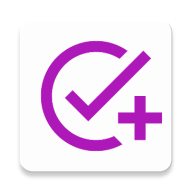
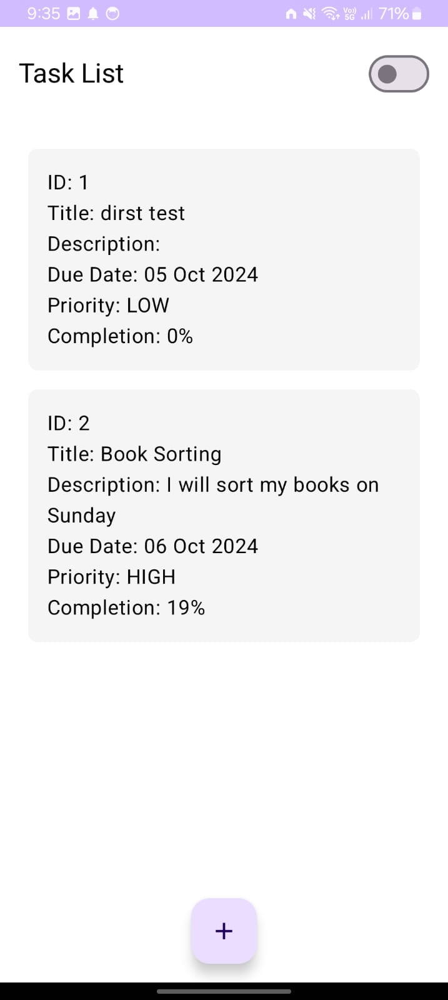
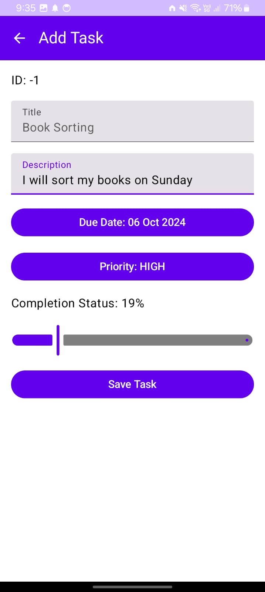
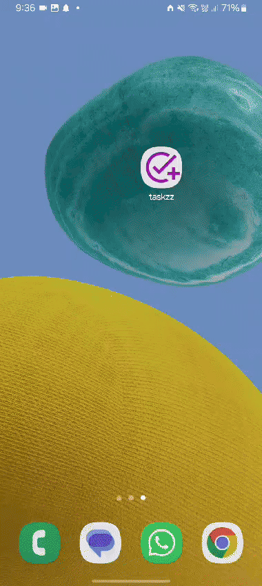

# Taskzz - Task Management Application

<p>
  
</p>

## Download

<a href="https://github.com/rohanudhwani/taskzz/raw/master/Taskzz.apk" class="download-button" download>
        
</a>

## Project Overview

**Taskzz** is a task management application designed to help users organize their daily tasks
efficiently. The app allows users to create, update, and delete tasks, providing a clean and
intuitive user interface to manage their productivity. Built with modern Android development
practices, Taskzz aims to provide a seamless user experience while leveraging Jetpack libraries for
data management and UI components.

## Features

- **Create Tasks**: Users can add new tasks with details including title, description, priority, and
  due date.
- **Update Tasks**: Existing tasks can be modified, allowing users to change details as needed.
- **Delete Tasks**: Users can remove tasks they no longer need.
- **View Tasks**: A clear list view to see all tasks with their statuses and priorities.
- **Dark Mode**: Support for dark mode to enhance usability in low-light environments.

## Screenshots

<table style="width: 100%; text-align: center;">
  <tr>
    <td style="padding: 10px;">
      <h3>Task List</h3>
      
    </td>
    <td style="padding: 10px;">
      <h3>Add Task</h3>
      
    </td>
    <td style="padding: 10px;">
      <h3>Update Task</h3>
      
    </td>
  </tr>
</table>


## Setup Instructions

To set up the Taskzz application on your local machine, follow these steps:

### Prerequisites

- [Android Studio](https://developer.android.com/studio) installed on your computer.
- [Kotlin](https://kotlinlang.org/) support enabled in Android Studio.
- An Android device or emulator to run the application.

### Clone the Repository

```bash
git clone https://github.com/yourusername/taskzz.git
cd taskzz
```

### Open the Project

1. Launch Android Studio.
2. Click on **Open an existing Android Studio project**.
3. Navigate to the cloned `taskzz` directory and select it.

### Sync Gradle

Once the project is open, sync Gradle by clicking on **Sync Now** in the notification bar.

### Run the Application

1. Connect your Android device or start an emulator.
2. Click on the **Run** button in Android Studio (green triangle).
3. Select your device and the application will be installed and launched.

## Key Design Decisions

- **MVVM Architecture**: The application uses the Model-View-ViewModel (MVVM) architecture to
  separate concerns, making the codebase easier to maintain and test.
- **LiveData**: Utilizes LiveData for observing data changes, allowing the UI to reactively update
  when data changes occur.
- **Room Database**: Implements Room as the local database solution for persisting tasks, providing
  a straightforward API for database access.
- **Unit Testing and Test-Driven Development (TDD)**: The application is developed with a focus on
  testability. Unit tests are written for the ViewModel and repository classes to ensure that
  business logic behaves as expected. Test-Driven Development (TDD) principles are applied, where
  tests are written before implementation, promoting a more robust and error-free codebase.
- **Modularization**: The codebase is organized into modules, separating features and
  functionalities. This modular approach facilitates easier collaboration among team members,
  improves build times, and enhances maintainability. Each module can be developed, tested, and
  deployed independently, allowing for faster iterations and updates.


## Contributing

Contributions are welcome! Please submit a pull request or open an issue to discuss any changes
you'd like to propose.
